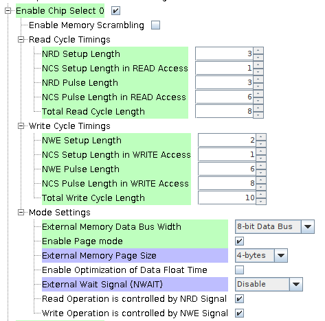

# ATSAMV71Q21 Component Drivers

Libraries for interfacing various hardware components and ICs with ATSAM microcontrollers

# Platform Specific Definitions

## MCP9808

Each subsystem shall define MCP9808_TWI_PORT in a platform specific header file.

### Connecting the MCP9808 at the Xplained V71 Dev Board

You should set the I2C_USER_ADDRESS to a defined value. This is done by setting the A0-A1-A2 pins of the temperature sensor.

The default code in this repository is using the address 000, so the below instructions set the pins to ground.

### Pins 

I2C Data Pin PD27 is assigned to D20 on the Dev board

I2C Clock Pin PD28 is assigned to D21 on the Dev board

Use a pair of Pull-Up Resistors each, one from Data and one from Clock, up to VCC. For a simple connection using small jumpers, a pair of 1kΩ each is appropriate. (you can skip this step if you are using the [breakout board](https://www.adafruit.com/product/1782)).

### MCP9808 Connections:
| Breakout Pin | Connection | Notes |
| ------ | ----- | ----- |
| SDA | I2C Data | Connect to PD27 |
| SCL | I2C Clock | Connect to PD28 |
| Alert | GPIO | Unused |
| GND | Ground | Set to common ground |
| A2 | A2 | Set to common ground |
| A1 | A1 | Set to common ground |
| A0 | A0 | Set to common ground |
| Vdd | Power 3V3 | Set to 3V3 from the dev board |

Our breakout board currently skips two pins Pin 4 and Pin 7. For example MCP's Pin 4 is connected to the breakout's Pin 5. 

## MRAM - MR4A08BUYS45

The OBC subsystem uses a Magnetoresistive Random Access Memory (MRAM) which is a non-volatile 
memory to store critical data.

The OBC microcontroller uses the Static Memory Controller (SMC) of the External Bus Interface (EBI)
to 
communicate with that memory. 
More 
specifically the EBI pins:
- 94 -> NRD: negative read
- 97 -> NCS0: negative chip select
- 82 -> NWE: negative write
- MEM_A\[0-20\]: address pins from A0 to A20
- MEM_D\[0-7\]: data pins from D0 to D7

The configuration for the pins is done through the SMC peripheral on the Harmony Configurator.
The configuration of the SMC peripheral is as shown below for the EQM OBC/ADCS Board

